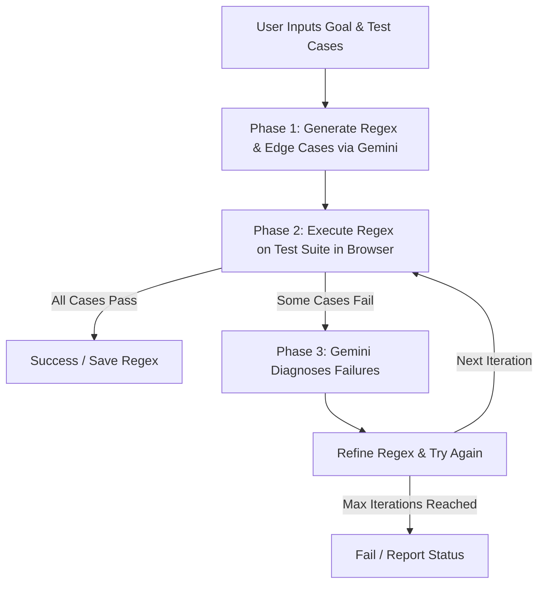

# RegexForge: Regex Generator & Tester

`RegexForge` is a responsive, premium Angular web application designed to take plain English regular expression descriptions and generate, test, and refine regex patterns. 

Using the Gemini API, the application executes a self-correction loop in the browser by running generated regex patterns against real test cases, diagnosing failures, and iteratively refining the pattern until all cases pass.

---

## Key Features

- **Autonomous Regex Generation**: Generates candidate regular expressions from natural language descriptions (e.g., "Match a valid IPv4 address").
- **Browser-based Self-Correction Loop**:
  1. **Phase 1: Generation**: The agent leverages `gemini-1.5-flash` to propose a regex pattern and synthesize additional edge-case test suites.
  2. **Phase 2: Verification**: The application executes the compiled regex locally in the browser against all test cases.
  3. **Phase 3: Diagnosis & Refinement**: If any test cases fail, the agent analyzes the failures and modifies the pattern, continuing the loop until all test cases pass or it reaches the maximum iterations.
- **Interactive Playground**: A live-updating tester pane to manually evaluate the generated regex against custom text inputs and extract matched capture groups in real-time.
- **Test Suite Preset Library**: Built-in template presets for standard validation tasks:
  - US Phone Numbers
  - ISO Dates (YYYY-MM-DD)
  - CSS Hex Color Codes
  - Secure Passwords
  - IPv4 Addresses
- **Agent Activity Logs**: A real-time telemetry console showing step-by-step reasoning, raw Gemini responses, compiler errors, and verification metrics.
- **Local Storage Persistence**: Safely saves your Gemini API Key in the browser's local storage.

---

## Architecture Overview

The project is built on **Angular 20** and utilizes modern framework features:
- **Angular Signals**: Efficient reactive state management for real-time telemetry, test case status, and execution state.
- **Single Component Architecture**: An elegant, fast, and completely responsive dashboard layout.
- **Gemini API SDK**: Integrated via `@google/generative-ai` to handle the generation and self-correction reasoning cycles directly in the client.

---

## Getting Started

### Prerequisites
- [Node.js](https://nodejs.org/) (v18.x or later)
- [npm](https://www.npmjs.com/)
- A **Gemini API Key** (Get one from [Google AI Studio](https://aistudio.google.com/))

### Installation
1. Clone the repository and navigate to the project directory.
2. Install the dependencies:
   ```bash
   npm install
   ```

### Running Locally
To launch the development server, run:
```bash
npm run dev
# or
ng serve
```
Open your browser and navigate to `http://localhost:4200/`.

---

## Self-Correction Loop In Action



### Prompt Engineering & Flow
- **Iteration 1**: Instructs Gemini to output a structured JSON response containing the regex, a human-readable explanation of how the pattern works, and a list of new AI-suggested positive/negative edge cases.
- **Iteration N**: Passes the list of failed test cases (including expected vs. actual matches) back to the model, instructing it to diagnose the failure and provide a corrected pattern.

---

## Commands Reference

### Code Scaffolding
To generate a new component, service, or pipe:
```bash
ng generate component component-name
```

### Building for Production
To build the optimized production package:
```bash
ng build
```
The build artifacts will be saved in the `dist/` directory.

### Running Unit Tests
To run unit tests via Karma:
```bash
ng test
```

